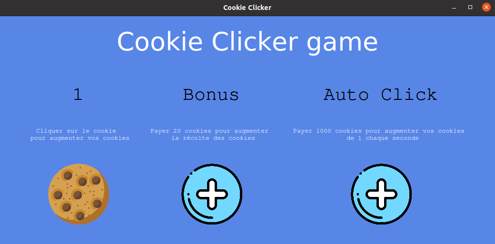

# Cookie Clicker avec python et le module Tkinter

**Le projet**

Vous connaissez tous le fameux jeu "Cookie clicker" pas vrai? 

Le but n'est pas bien compliqué, cliquer un maximum sur le cookie pour en avoir de plus en plus et acheter des bonus pour en avoir encore plus. 

**Realisation**

Ce cookie clicker est donc réalisé dans le langagne Python. A l'aide du module d'interface graphique "Tkinter". 

**Le but du workshop**

A la fin de cette présentation, nous aurons utilisé des fonctions basiques, et les fonctions liées à Tkinter. 

Nous aurons donc une interface colorée, des images cliquables, et la possibilité d'envahir le monde entier de cookies ! (Si vous cliquez beaucoup, évidemment.)

**Et après?**

Après, vous serez donc en mesure de comprendre un peu mieux ce module, et qui sait, de faire votre propre app de cookie-clicker encore plus badass. 

Bon code à tous, et bonne journée :) 

**Aperçu du projet final** 

